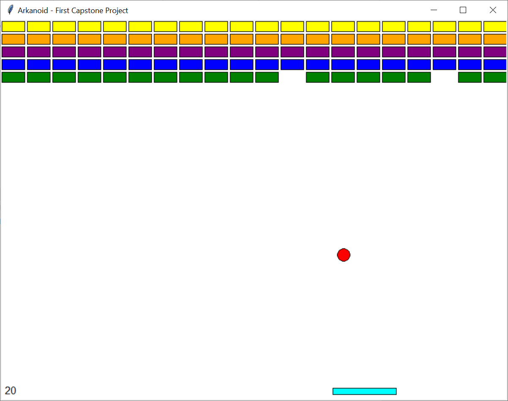

# Capstone project: Arkanoid game

Arkanoid is an arcade game from the 1980's.
The player controls a rectangular craft at the bottom of the screen, moving
it left and right, to deflect a ball and eliminate a number of bricks by
hitting them with the ball.

Learn more about Arkanoid and view a screenshot on Wikipedia: https://en.wikipedia.org/wiki/Arkanoid

You can view the gameplay of Arkanoid on YouTube: https://www.youtube.com/watch?v=Th-Z6QQ5AOQ

> Fun fact: Google's DeepMind was able to develop a Machine Learning (ML) algorithm which achieved to teach itself to
play Arkanoid like a  pro human. See the video on YouTube: https://www.youtube.com/watch?v=V1eYniJ0Rnk

## Requirements:
1.    A functional game
2.    The rectangular craft is effectively controlled by the user using the mouse - the craft moves only left/right
3.    The ball must be deflected on objects in the game, e.g., the player craft and the bricks
4.    When the ball hits a brick, the brick must be destroyed, i.e., removed from the game
5.    When the ball reaches the bottom edge of the screen, the player looses
6.    When all bricks are destroyed, the player wins the game

## Marking scheme:

### Pass (40%+)
* Implement a functional program which compiles and runs (with few or no crashes)
* Implement a Craft class (i.e., the player-controlled cyan rectangle at the bottom of the screen) - the craft must be 
controlled with the mouse and must move horizontally only, at the bottom edge of the window
* Implement a Ball class which is animated as a red ball moving in the window, and deflected on the window edges and on 
the craft

### Lower Second (50%+)
* Implement a class for Brick
* Populate the top of the window with 5 lines of Bricks (aim for 10+ bricks per line)

### Upper Second (60%+)
* Each brick line is a different color
* Bricks are correctly destroyed and removed from the game each time the ball collides on one of them

### First (70%+)
* Implement Score as a class to display the score in text
* Display the score (points) in the bottom left corner of the window
* Correctly update the score whenever you destroy a brick - each destroyed Brick gives the player +10 points

### High First (80%+)
* When the Ball is bounced on the Craft, the horizontal speed (X) is adjusted depending on where it touches the craft -
when it touches the craft at the very left end, the speed on X becomes -10 and when it touches the very right end, the
speed on X becomes +10. When it touches an intermediate it is adjusted accordingly, e.g., the middle makes the speed on
X equal to 0.
* Add a custom background
* Provide additional levels with an increasing difficulty for the player
* Improve the aesthetics of the game by showing a trail of the last five or ten places where the ball was moving - for
an example, see the code of ManyCircles.py from week 2

Hints:
- You can use the solution to exercise 2 from week 2 as a basis for the Craft moving left/right.
- You can use the BallAsAClass from week 3 as basis for a Ball bouncing within the window.
- Add code in your animation loop to detect when the Ball deflects on the Craft, and when the player loses i.e.,
when the ball touches the bottom side of the window.

This is an example of what the end game _could_ look like:

