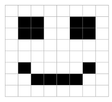

## Images

In their simplest form, images are just a collection of pixels.

Consider this 8x8 image of a smiley face:



This could be encoded in a 64-bit array, where the first 8 bits represent the first row, the next 8 bits the second
row, etc.

```python
smiley = [
    False, False, False, False, False, False, False, False,
    False, True, True, False, False, True, True, False,
    False, True, True, False, False, True, True, False,
    False, False, False, False, False, False, False, False,
    False, False, False, False, False, False, False, False,
    False, True, False, False, False, False, True, False,
    False, False, True, True, True, True, False, False,
    False, False, False, False, False, False, False, False,
]
```

In the example above, the array has 64 entries. Each entry is a boolean value, where ``True`` means draw the pixel
(i.e., black) and ``False`` means don't draw it (i.e., leave it white).

In this step, you will read the ``smiley`` array and draw a pixelised version of it in the window.

Go on, read the instructions in the ``smiley.py`` file.
