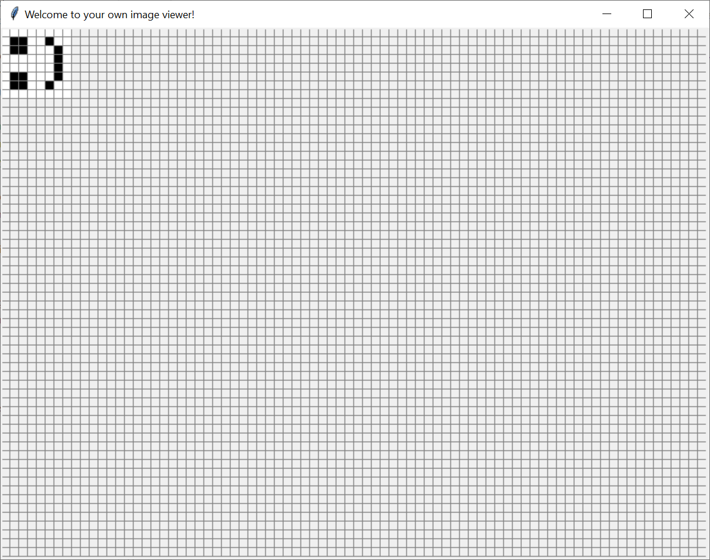

## 2-Dimensional arrays

So far we have been using a 1-Dimensional arrays of Booleans to store the pixels in a picture.
For example, for the smiley we used:

```python
smiley = [
    False, False, False, False, False, False, False, False,
    False, True,  True,  False, False, True,  True,  False,
    False, True,  True,  False, False, True,  True,  False,
    False, False, False, False, False, False, False, False,
    False, False, False, False, False, False, False, False,
    False, True,  False, False, False, False, True,  False,
    False, False, True,  True,  True,  True,  False, False,
    False, False, False, False, False, False, False, False
]
```

This is a 1-Dimensional array of size 64, used to store a 2-dimensional image, covering 8 rows, each with 8 pixels.

To access values that correspond to rows and columns, you need to apply some mathematical formulas, to transform from
``[row,col]`` to ``index``, and vice versa.

Specifically, to convert a pair of ``[row,col]`` to ``index`` (where all of these values range from ``zero`` to
``max-1``), you can use:

```python
index = row * row_size + col
```

And for transforming in the opposite direction from ``index`` to ``[row,col]`` you can use:

```python
row = index // row_size  # note this is the integer division where any fractional part is ignored
col = index % row_size   # this subtracts any 'full' rows and leaves only the remainder
```

### Step Quiz

The following array contains values which correspond to the indices of each element.

```python
example = [
     0,  1,  2,  3,  4,  5,  6,  7,
     8,  9, 10, 11, 12, 13, 14, 15,
    16, 17, 18, 19, 20, 21, 22, 23,
    24, 25, 26, 27, 28, 29, 30, 31,
    32, 33, 34, 35, 36, 37, 38, 39,
    40, 41, 42, 43, 44, 45, 46, 47,
    48, 49, 50, 51, 52, 53, 54, 55,
    56, 57, 58, 59, 60, 61, 62, 63
]
```

Can you verify that the above formulas work? Specifically, try to compute:
- The ``index`` of the 3rd row, 4th col
- The ``[row,col]`` of index 38

See the answers at the end of this page.

### 2-Dimensional arrays in Python 

In Python you can define 2-Dimensional arrays, effectively by defining an array *containing other arrays* as elements.

```python
my_2d_smiley = [
    [False, False, False, False, False, False, False, False],
    [False, True,  True,  False, False, True,  True,  False],
    [False, True,  True,  False, False, True,  True,  False],
    [False, False, False, False, False, False, False, False],
    [False, False, False, False, False, False, False, False],
    [False, True,  False, False, False, False, True,  False],
    [False, False, True,  True,  True,  True,  False, False],
    [False, False, False, False, False, False, False, False]
]
```

Here, you have a 2-D array. You can access individual elements as follows: ``my_2d_array[row][col]``.

Essentially, the first index returns an array. For example ``my_2d_array[2]`` returns the 3rd nested array:
```Python
[False, True,  True,  False, False, True,  True,  False]
```

When the second index is applied, e.g., ``a[3]``, then the 4th element of the array is selected, i.e., ``False``.

So, the notation ``my_2d_array[2][3]`` picks the third row, fourth element, which happens to be a ``False``.

### Challenge

Look at te code in the ``arrays_2d.py``. It uses a 2-Dimensional array to encode smiley, as illustrated above.
However, there is small mistake in the code, printing the smiley tilted, as below.



Can you fix the problem?

- Hint 1: the solution involves editing just one line of code
- Hint 2: the problem is inside the function ``draw_picture``

### Answers to the Step Quiz

- The ``index`` of the 3rd row, 4th col:

Looking up at the array, that's the value ``19``.
The rows are ranged ``0..7`` so the 3rd row is ``2``. Similarly, the 4th col ``3``. 
Applied to the formula ``index = row * row_size + col``, the index is computed to be ``2 * 8 + 3`` which also gives
us ``19``.

- The ``[row,col]`` of index 38:

Looking up the array, the answer must be ``[4,6]`` (i.e, 5th row, 7th col).
When we apply the formulas we get:
```python
row = index // row_size = 38 // 8 = 4  # remember, the fractional part is ignored
col = index % row_size = 38 % 8 = 6
```
Thus, the row and col are correctly computed to be ``[4,6]``.
