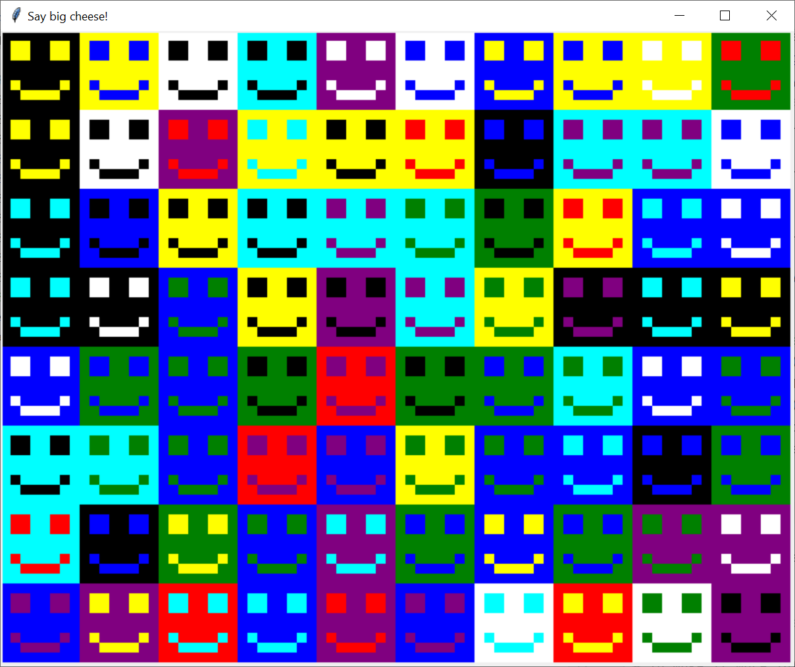

# Exercise 0501 - Colorful

Starting from the code of [big_smile.py](../step0502/big_smile.py) in step 0502, we will enable drawing the smile image
in color!

1. First, add another parameter to the 'draw_big_array' function to set both the foreground and background colours
(instead of always using 'white' for the background).

2. Create a loop to fill the window with coloured smileys, using random colors (e.g., 'red', 'blue', 'green',
'yellow', 'purple', etc.). Add logic to avoid having the foreground colour match the background one. For a
quick fresh-up on using random numbers, revisit step [0305](../../week03-animation/step0305/TwoBalls.py) in week 03.
For an example of what the result would look like, have a look at the ``smiles.png`` picture:

