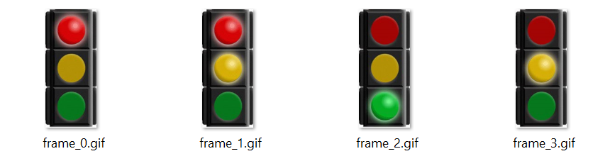

# Displaying a GIF animation image

If you have spent any time on the Web, you could not have missed the GIF animations filling
websites, especially in social media.

These animations, which appear as very short videos in a loop, are actually sequences of normal
images, played with a set timing. You can learn more about the history and format of GIF by
visiting the corresponding [GIF page](https://en.wikipedia.org/wiki/GIF) on Wikipedia.

For example, consider the following GIF image ``traffic-lights.gif``, consisting of 4 frames in a loop:

You can actually *break down* this GIF to its frames using any of the many tools available
online. For example, using [EZGIF](https://ezgif.com/split) you can easily find that this
animation consists of 4 frames, switching from one to the next every 1 second.

The individual frames are extracted and stored under ``/frames``.

In this step, you will learn how to *load* multiple images (aka frames), and then use code to run animation
switching from one to the next one.
Proceed to read the code, and the embedded comments, in the [traffic_lights.py](traffic_lights.py)

