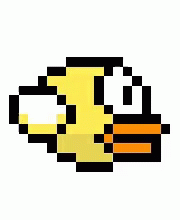

# Animating characters

Alright now we have seen how GIFs work. Hope taking away the mystery will not make you laugh less next
time you see a silly animation on your favourite social site :-)

The same technique of switching between frames, can also be used for animating a game character.

Remember [Flappy bird](https://en.wikipedia.org/wiki/Flappy_Bird)? It had quite a story back in 2013.

[Flappy Wings - Credit Tenor](https://tenor.com/view/flappy-wings-gif-12998779)

This animation consists of [9 frames](flappy-wings-frames.png), separated by 0.1 seconds.

The individual frames are extracted and stored under ``/frames``.

Can we use the same technique of switching between frames to animate a character in a game?

See an approach for realizing this in ``flappy_wings.py``.
