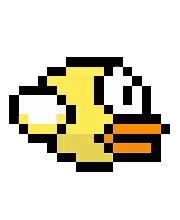

# Adding interaction to animated characters

In the previous step, we implemented an animated version of the *flappy bird* character.

In this step, we go one step further, and make it interactive. Specifically, we bind the *spacebar* button
to an action that makes the character *jump*.

## How does a character jump?

A trivial answer would be to change its Y coordinates, moving it a few pixels up for some time, then
bring it back down by changing its Y coordinates again to the original position. In pseudocode, this would
look like this:

```
on jump:
    # change the coordinates of the character, by changing its Y coordinates by offset pixels
    y = y - offset
    # wait for some time...
    wait(100)
    # change the coordinates of the character, by changing its Y coordinates back to its original value
    y = y + 100
```

And in practice it would look like this:



## Making a jump look more natural

The above code is fine for doing a simple animation, however it doesn't look very natural. A more natural
jump would show the bird gradually move upwards, then back down.


An approach for realizing this in code is shown in ``interactive_flappy_wings.py``.

When ``in_a_jump``, the character executes a sequence of moves, as indicated in the ``jump_offsets`` array.
Each entry in this array defines the offset (in # of pixels) for the character movement. Negative values
are movement upwards, and positive values are downwards. For the character to end up to its original
position, the offsets must add up to zero. Additionally, when already ``in_a_jump``, the character should
not be able to initiate another jump.

The implementing code is listed below:

```python
in_a_jump = False  # this boolean values tells us when already in a jump as to not start another one
# below are the movements of a jump over time - they must add up to 0 - having this instead of a fixed set of constant
# offsets (e.g., -10, -10, -10...) allows us to imitate a more natural jump (negative is up, positive is down)
jump_offsets = [0, -60, -45, -30, -20, 0, 20, 30, 45, 50, 25, -15, ]
# the jump index is used to keep track of the phase of the jump, it completes after len(jump_offsets) steps
jump_index = 0


def update(index):
    global in_a_jump, jump_index
    canvas.itemconfig(flappy_wings, image=frames[index])

    # if in a jump, move the character by jump_offset
    if in_a_jump:
        jump_offset = jump_offsets[jump_index]
        canvas.move(flappy_wings, 0, jump_offset)  # the 'canvas.move' function moves the specified object by the specified X.Y offset
        jump_index = jump_index + 1  # prepare for the next phase of the jump
        if jump_index > len(jump_offsets)-1:  # when the jump ends, reset the jump_index and set in_a_jump back to False
            jump_index = 0
            in_a_jump = False

    # update the frame picture
    caption_label.configure(text='frame %i' % index)
    index += 1
    if index == FRAME_COUNT:
        index = 0
    win.after(DELAY, update, index)


def jump(__self__):
    global in_a_jump
    if not in_a_jump:  # only process the jump event if no other jump is in progress
        in_a_jump = True


win.bind("<space>", jump)
```
