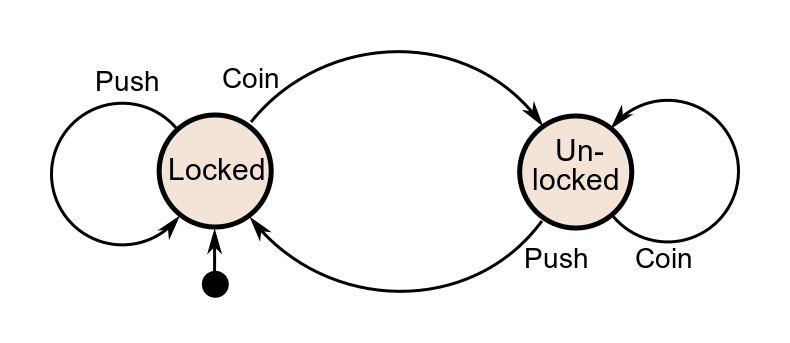
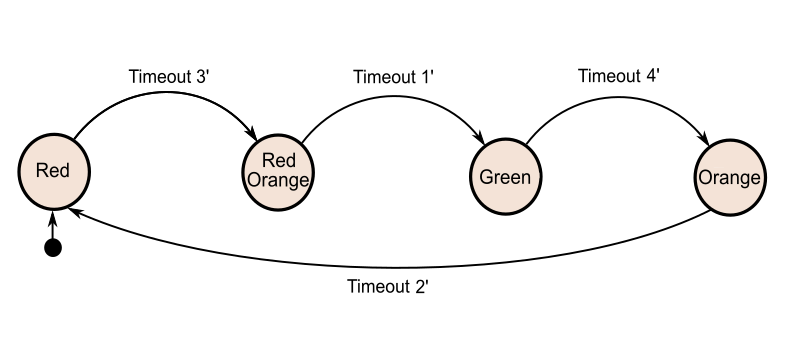

# Exercise 0602 - State Diagrams

Sometimes in software it helps to think of a system as a [state machine](https://en.wikipedia.org/wiki/Finite-state_machine).
A *state machine* (aka Finite State Machine) is a mathematical model used to abstract a real-world mechanism or
a software artefact. It has these characteristics:
- It has a **finite** number of states (i.e., it cannot have an infinite number of states)
- One of those states is set as the **starting state**
- At any given time, it can be in **exactly one** of the states
- The state machine can **transition** from one state to another in response to some **input**

A state machine is typically defined by:
- A list of its **states**
- The **starting state**
- A list of the **inputs** and the resulting **transitions**

## Turnstile example

At this point, have a look at the [turnstile example](https://en.wikipedia.org/wiki/Finite-state_machine#Example:_coin-operated_turnstile)
on Wikipedia:

Make sure to identify the **states**, **starting state**, and the table with **inputs** and **transitions**:
- The **states**: ``Locked``, ``Unlocked``
- The **starting state**: ``Locked``
- The **state transition table**:

| Current state     | Input   | Next state     | Output                                                      |
|-------------------|---------|----------------|-------------------------------------------------------------|
| Locked            | Coin    | Unlocked       | Unlocks the turnstile so that the customer can push through |
| Locked            | Push    | Locked         | None                                                        |
| Unlocked          | Coin    | Unlocked       | None                                                        |
| Unlocked          | Push    | Locked         | When the customer has pushed through, locks the turnstile   |

## Traffic lights example

In [traffic_lights.py](../step0602/traffic_lights.py) we implemented a simple animation, where each frame was displayed
for exactly 1 second. In reality, the transition between states uses different waits between states, e.g., you stay at
the ``red`` state for 60 or more seconds, then switch to ``red-orange`` for a brief 1 second, then to ``green`` for
another 60 seconds, and so on.

Consider the following state diagram for traffic lights:

To keep it more manageable during development and debugging, we use shorter wait periods between 1 and 4 seconds.

In this exercise you have two challenges:

1. Identify the **states**, **starting state**, and the table with **inputs** and **transitions** for the traffic
lights state machine:
- The **states**: 
- The **starting state**: 
- The **state transition table**:

| Current state | Input | Next state | Output                                                    |
|---------------|-------|------------|-----------------------------------------------------------|
| ...           | ...   | ...        | ...                                                       |
| ...           | ...   | ...        | ...                                                       |

You can type your answer is a plain text file (or if you prefer a challenge, in [Markdown](https://en.wikipedia.org/wiki/Markdown)).

2. Edit the code in the [traffic_lights.py](../step0602/traffic_lights.py) program so that it realizes the varying
delays between each pair of states.
