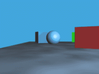

# Adding depth

A trick used widely in games to add the illusion of depth, is to split the background into
different layers, and move each one at a different speed: farther layers should move *slower* and
nearer layers should move *faster*.

> **Parallax**: a 3D effect observed when images and other elements in the foreground of a screen move at a different rate than those
> in the background
> ([source](https://www.dictionary.com/browse/parallax)).
 
A simple example of the 3D parallax effect is seen below:

The above animation was created by *Nathaniel Domek* ([source](https://commons.wikimedia.org/wiki/File:Parallax.gif)).

How can we achieve the same effect in our programs?

## Split the background image into layers

The first step is to split the background image into three layers. Working on our original image, we
can split it into:

1. The [sky and clouds](background-sky-and-clouds.png) layer:

2. The [trees and buildings](background-trees-and-buildings.png) layer:

3. The [ground](background-ground.png) layer:

## Animate their movement at different paces

Have a look at the [adding_depth.py](adding_depth.py) file.
