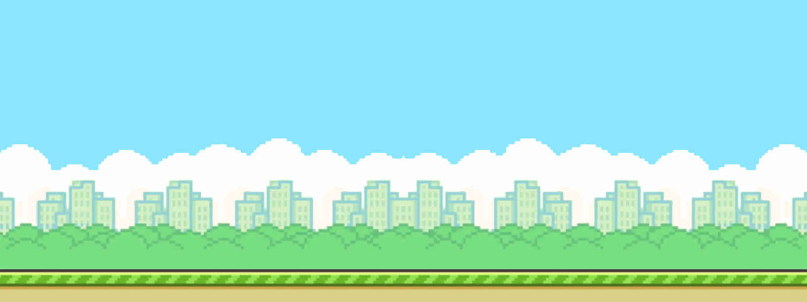

# Exercise 0702 - Loop the background image

Revisit the code from ``step0702``, [moving_background_in_loops.py](../step0702/moving_background_in_loops.py).

You are provided with a new, double-length image (1600 width x 600 height) named 'background-long.png':

Use this as the background image. Edit the `update` function accordingly,
to enable as smooth a transition as possible.
