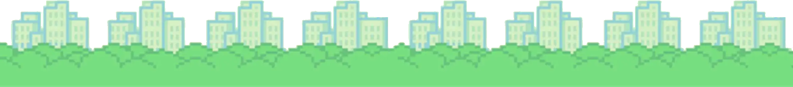

# Exercise 0703 - Adding depth

Revisit the code from ``step0703``, [adding_depth.py](../step0703/adding_depth.py).

At the moment, only the *sky and clouds* and the *ground* images are used.

1. Using the code of [adding_depth.py](../step0703/adding_depth.py) as a starting point,
add the intermediate layer of *tress and buildings*, which must be moving at a pace between
the two other layers:

2. As an additional challenge, aim to animate the sun, Specifically, add code to switch
the sun frame every 4 frame updates, using the given images (in folder [/sun-frames](./sun-frames) ):

