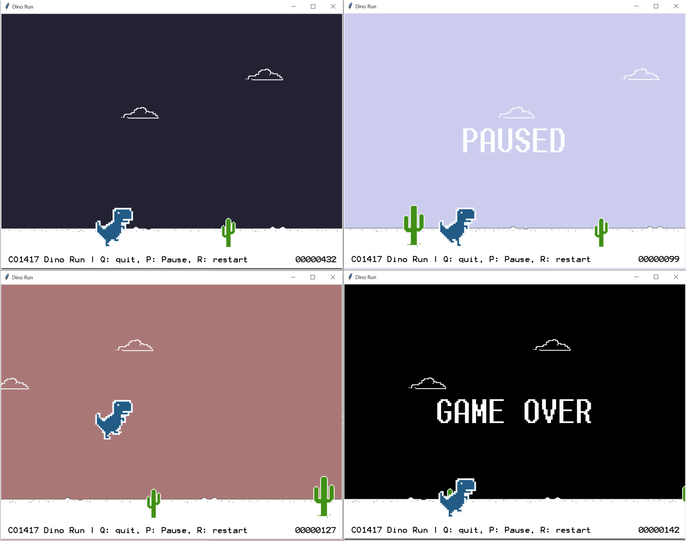

# Capstone project: Dino (Runner) game

If you are using the Chrome weh browser, you must have seen the [Dino game](https://en.wikipedia.org/wiki/Dinosaur_Game),
which shows up when your computer is not connected to the Internet.

> If interested to learn how the Chrome engineers thought of adding this hidden game in Chrome, have a look at the
> [Chrome dino blog post](https://www.blog.google/products/chrome/chrome-dino/).

In this assignment you are asked to develop your own **Dino Run** game. You can develop your own graphics or simply
use the ones provided under the [/resources](resources/) folder.

## Requirements:
1.    A functional game
2.    The character is animated (rather than shows as a fixed image)
3.    The character responds to user input (e.g., for jumps)
4.    When the character jumps, a natural jump is simulated
5.    When the character hits a cactus, the game ends

## Marking scheme:

### Pass (40%+)
* Implement a functional program which compiles and runs (with few or no crashes)
* Implement a minimal game where the character is animated and the ground is continuously shifted to create the 
illusion of movement
* Your character can jump as a response to user input (not necessarily in a smooth manner)

### Lower Second (50%+)
* Your character can jump as a response to user input, imitating a natural jump (goes up quickly, slows down, then
starts moving downwards slowly, then faster)
* Your game includes background items (e.g. clouds) which move at a lower speed to create a parallax phenomenon

### Upper Second (60%+)
* The cactus (obstacles) appear in a random way (but paced so that they keep a meaningful distance from each other)
* When the character touches a cactus, the game ends, you stop the animation, and you display a 'Game Over' message in
the window 
 
### First (70%+)
* You maintain a score which simply increases with time (one point every 100ms), and display it in the bottom right corner
* Make the sky color change over time (e.g., to imitate noon, afternoon, sunset, night, sunrise, etc.)
* Add more obstacles such as combinations of multiple small or big cacti
* Add shortcuts to Pause, Quit, and Restart the game

### High First (80%+)
* Make your game become more difficult with time, e.g. by speeding it up or by adding other forms of obstacles like birds
* Add a high score feature (possibly reading/writing the high scores in a file)
* Add other cool features which make you to want to play more :-)

Hints:
- You can use the solution to exercise 4 from week 7 as a basis for the game.

This is an example of what the end game _could_ look like:

