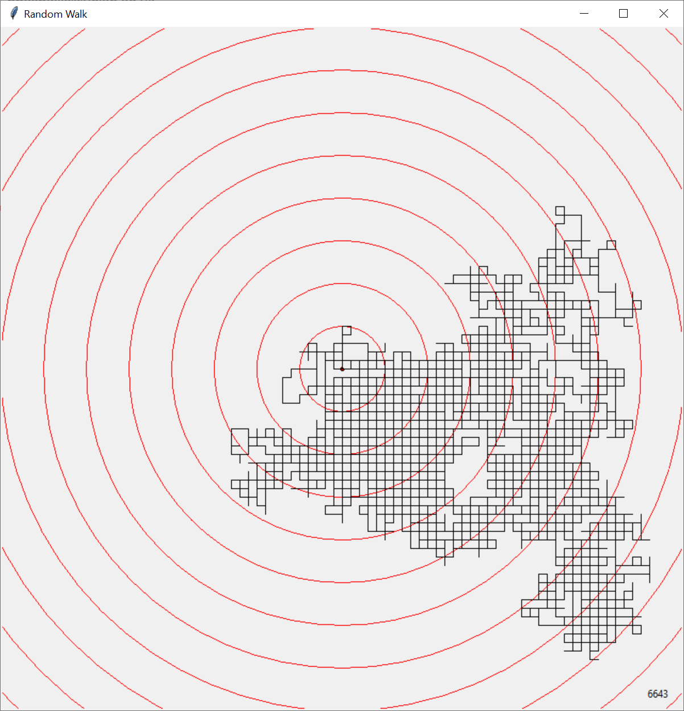

# Random Walk

A random walk is exactly what you'd expect from the term _random_ :-)
It is a path that you can draw by taking a random step each time.

To keep it simple, assume that a random step can be to move either ``up``, ``right``, ``down``, or ``left``.

For simplicity, assume the starting point is ``(0,0)``. Then when you move ``right``, your position becomes ``(1,0)``.
If you move further ``down``, then your position becomes ``(1,-1)``, etc.

To simulate a _Random Walk_ we developed a small program with graphics: [random_alk.py](random_walk.py). When run,
this program produces output as shown below:

The small red circle is the center is where the path starts. The black lines show where the path goes. The red circles
indicate radii of values ``100``, ``200``, etc., outwards.

The code defines an infinite loop, which terminates when the path moves outside the edges of the window.

## Challenge (Exercise1102)

You are asked to study and run the code. You will notice that there is a glitch: the random walk is not so _random_
anymore. It seems that the code in the function ``random_direction`` was accidentally modified, and it always returns
the same value ``up``.

You are asked to fix the code so that the ``random_direction`` function returns ``up``, ``right``, ``down`` and ``left``
with equal chance.
