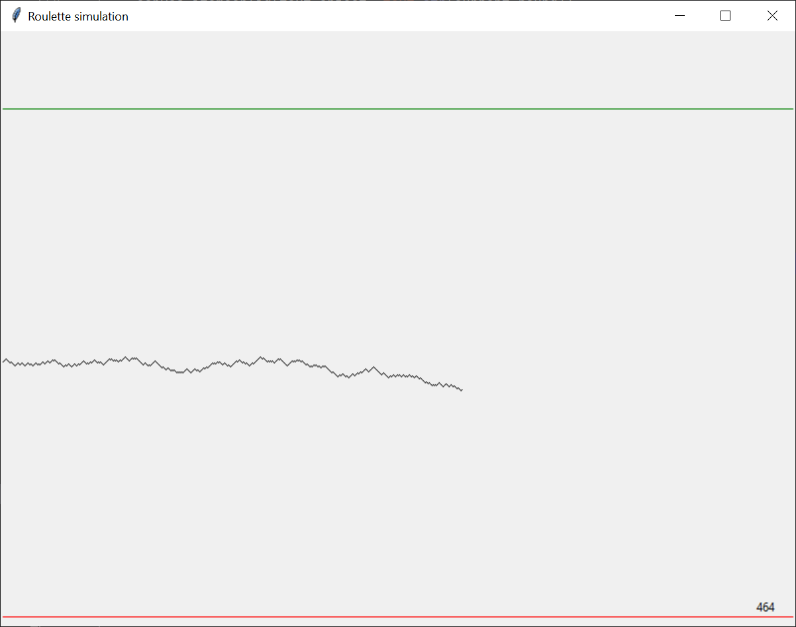
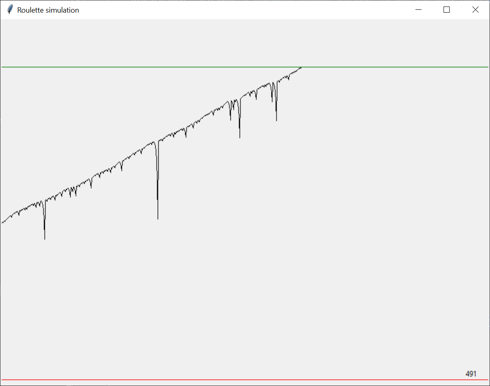
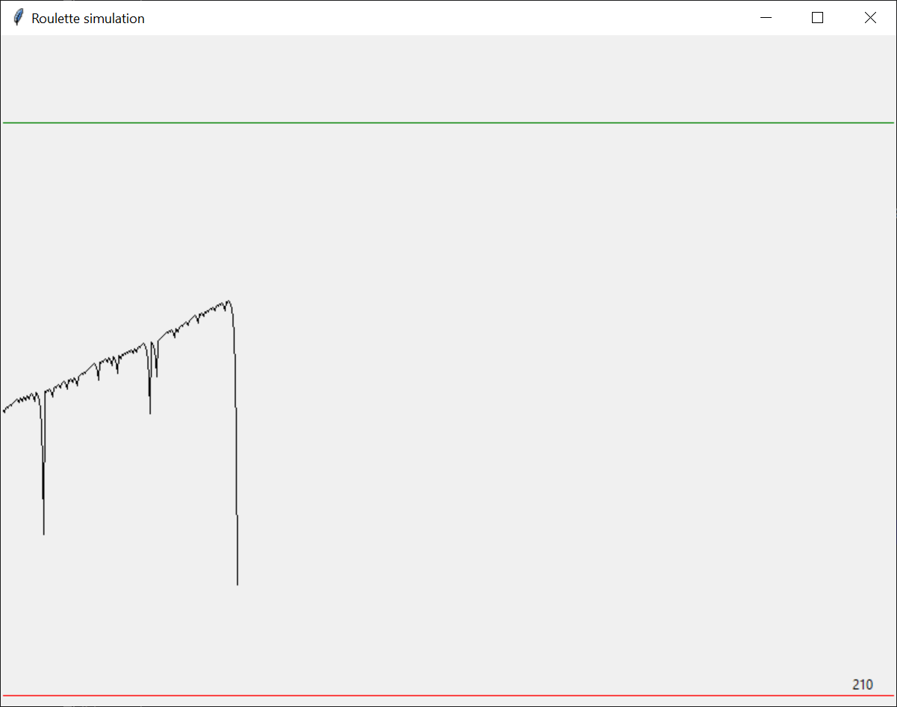

# Casino simulation

One of the most popular games in a casino is the [roulette](https://en.wikipedia.org/wiki/Roulette).
And one of the simplest bets in roulette is to play red/black, where your chances are approximately 50-50.

> In reality, your chances are lower than 50% because there is 1 or 2 green slots too. Remember, the casino _always wins_.

Assume that you are playing in a roulette with 18 ``red``, 18 ``black``, and 1 ``green`` slots.
Also assume that you always bet on ``red``. In this case, your chances for a win are ``18/37`` or approximately ``48.6%``.

You can implement a function to simulate these odds as follows:

```python
import random

# the French roulette has 37 slots: 18 red, 18 black, and 1 green - you can concatenate lists with the + operator
ROULETTE_COLORS = ['red' for i in range(16)] + ['black' for j in range(16)] + ['green']


def spin_the_roulette() -> str:
    """
    Returns one of 'red', 'black', 'green' in random, using the ROULETTE_COLORS chances.
    """
    return random.choice(ROULETTE_COLORS)
```
### Fixed bet strategy
Now assume you start with an initial balance of say ``256 units``. When you keep betting ``1 unit``, then over time
your balance will normally keep going down, slowly but surely.

This strategy is implemented in [casino.py](casino.py).

The program in this file simulates the bets, and visualizes the balance over time.
It also draws a _target line_ (512 units) in green. This simulates a strategy where you set a target (e.g., double your
initial money) and stop when you reach that.
Finally, it draws the _zero line_ (0 units) in red. This simulates the _reality_: you need to quit when you lose all your money.



### Martingale bet strategy (Exercise1103)

The [Martingale betting strategy](https://en.wikipedia.org/wiki/Martingale_(betting_system)) works as follows:
- Bet 1 unit
- If you lose, double the bet and try again
- If you win, add the cash to the balance, and reset the bet to 1 unit

In theory this strategy will always produce profits, as long as the player has infinite wealth to keep playing.
In practice, nobody has infinite wealth and thus this strategy does not really work to your benefit, especially when
you consider the fact that the odds are (slightly) against the player.

In this challenge, you are asked to edit the code in [casino.py](casino.py) to implement the Martingale strategy.
Once implemented, the screenshots will appear similar to the following (top for winning, and bottom for losing).




