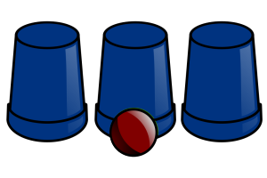

# Cups and Balls (Exercise 1104)

The cups-and-balls is often used as a magic trick, where the ball disappears or more balls appear.

But magic aside, the cups-and-balls routine can also be used to test the ability of your friends to concentrate and
keep their focus on a target.



In this challenge you are asked to create a program to realise a simulation of cups-and-balls.

- Assume the cups are numbered: 1 (left), 2 (center), and 3 (right).
- The one running the show can do either of 3 moves:
    - 'A': means swap the cups at positions 1 and 2
    - 'B': means swap the cups at positions 2 and 3
    - 'C': means swap the cups at positions 1 and 3

Create a function named ``simulate`` to compute the final positions of the ball.
- You can assume the ball always start under the 1st cup (left)
- The input will be a list containing a sequence of letters, e.g., ``['A', 'A', 'B', 'C']``.
- The output will be an integer, e.g., ``1`` or ``2`` or ``3`` saying where the ball is at the end.

```python
def simulate(moves) -> int:  # the arrow (->) means that the function returns a value of this type
    """
    This function simulates the moves and computes the final position of the ball.
    Assume the ball always start at the first cup.
    The 'moves' is a list containing any of 'A', 'B', and 'C', where:
        - 'A': means swap the cups at positions 1 and 2
        - 'B': means swap the cups at positions 2 and 3
        - 'C': means swap the cups at positions 1 and 3
    The function returns an int which corresponds to the cup where the ball is at the end: 1 for the first cup, 2 for
    the second, and 3 for the last.
    """
    # --- Add Your Code Here ... ---
```

You can verify your implementation by testing with the following three test cases:

````python
moves_0 = ['A', 'B', 'C']
expected_output_0 = 1
print(moves_0, '->', simulate(moves_0), 'with expected output:', expected_output_0)

moves_1 = ['A', 'A', 'B', 'C']
expected_output_1 = 3
print(moves_1, '->', simulate(moves_1), 'with expected output:', expected_output_1)

moves_2 = ['A', 'B', 'C', 'A', 'A', 'B', 'C', 'C', 'A', 'B', 'A', 'C', 'A', 'B', 'B']
expected_output_2 = 2
print(moves_2, '->', simulate(moves_2), 'with expected output:', expected_output_2)
````

The above should generate the following output:

```text
['A', 'B', 'C'] -> 1 with expected output: 1
['A', 'A', 'B', 'C'] -> 3 with expected output: 3
['A', 'B', 'C', 'A', 'A', 'B', 'C', 'C', 'A', 'B', 'A', 'C', 'A', 'B', 'B'] -> 2 with expected output: 2
```
