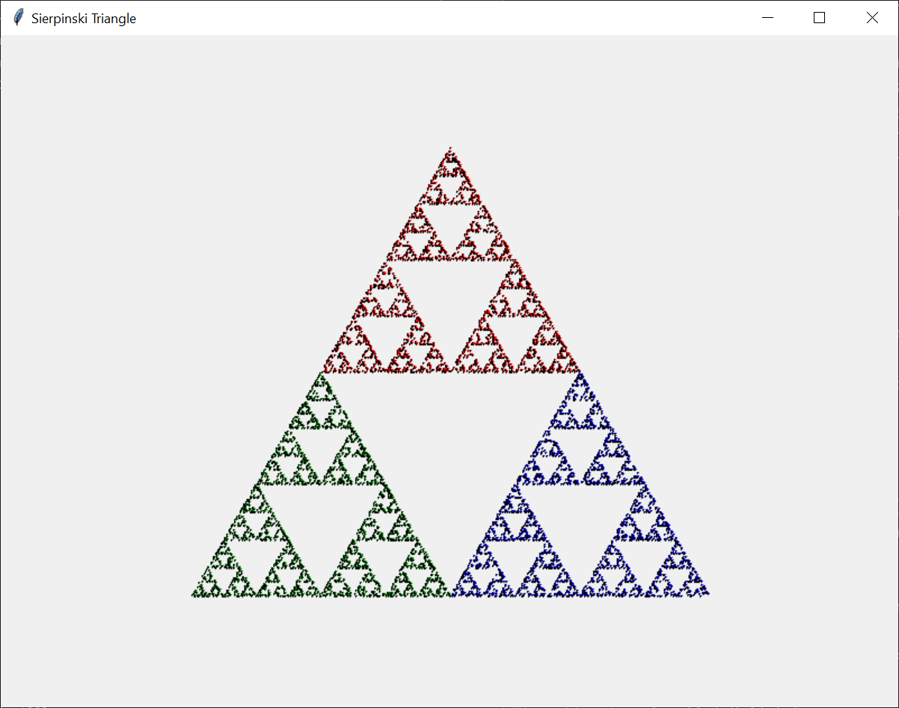

# Sierpinski triangle (Exercise 1105)

## Fractals

Have you ever heard of Fractals?

> A fractal curve is a mathematically formed graphic, which retains a general pattern regardless of how much you zoom

Zooming in on the Mandelbrot Set (source:
[Wikipedia](https://en.wikipedia.org/wiki/Fractal_curve#/media/File:Mandelbrot_sequence_new.gif))

## Sierpinski triangle

The [Sierpinski triangle](https://en.wikipedia.org/wiki/Sierpi%C5%84ski_triangle) is one of the simplest
ways to programmatically create a [fractal curve](https://en.wikipedia.org/wiki/Fractal_curve).

The rules are as simple as these:
- Start with 3 points A, B, and C forming an equilateral triangle (this works also with other triangles and even other
shapes, but we like simplicity and symmetry!)
- Choose a starting point in random. The point can be anywhere, even outside the triangle. To keep it simple, just
pick point A (or any of the other 2 nodes of the triangle) as the starting point.
- Repeat this algorithm forever:
  - Choose any of the 3 nodes ``A``, ``B``, ``C``, in random.
  - Find the midpoint between the current point, and the selected node
  - Make this midpoint the new point
  - Draw the new point
  - [Optional]: choose color based on the selected node, e.g., ``['red', 'green', 'blue']`` for ``['A', 'B', 'C']``
  respectively.

You are asked to implement the above algorithm.

A very simple, and step-by-step explanation is discussed in
[this article](https://beltoforion.de/en/recreational_mathematics/chaos_game.php),
and is visually demonstrated in [this video](https://www.youtube.com/watch?v=kbKtFN71Lfs).

> The midpoint m of points p1 = (x1, y1) and p2 = (x2, y2)
> is easily computed as follows:
> 
> m = (xm, ym), where xm = (x1 + x2) / 2, and
> ym = (y1 + y2) / 2

When you implement the algorithm yourself, you should get an output similar to the following screenshot:

