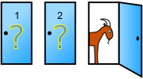
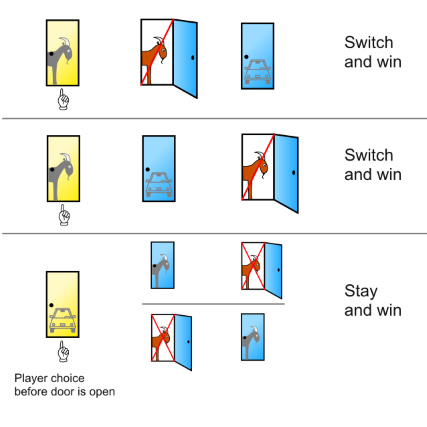

# Monty Hall (Exercise 1106)

## The Monty Hall problem

The Monty Hall problem is a well known puzzle. Its answer appears to be a paradox, so much which caused even some statisticians to doubt it in the past. 

> Suppose you're on a game show, and you're given the choice of three doors: Behind one door is a car; behind the others, goats.
> You pick a door, say No. 1, and the host, who knows what's behind the doors, opens another door, say No. 3, which has a goat.
> He then says to you, "Do you want to pick door No. 2?" Is it to your advantage to switch your choice? Or should you stick with your original choice?

## The paradoxical answer

The answer is that it is indeed to your advantage to switch, and select the remaining door. 
To most people, the correct choice is paradoxical: Why would changing your choice give you better chances?

The answer is explained well in Wikipedia's page on the [Monty Hall problem](https://en.wikipedia.org/wiki/Monty_Hall_problem):
Under the standard assumptions, the switching strategy has a 2/3 probability of winning the car, while the strategy of sticking with the initial choice has only a 1/3 probability.

> When the player first makes their choice, there is a 2/3 chance that the car is behind one of the doors not chosen.
> This probability does not change after the host reveals a goat behind one of the unchosen doors.
> When the host provides information about the 2 unchosen doors (revealing that one of them does not have the car behind it),
> the 2/3 chance of the car being behind one of the unchosen doors rests on the unchosen and unrevealed door,
> as opposed to the 1/3 chance of the car being behind the door the contestant chose initially.

## Prove by simulation

You are asked to prove that the correct strategy for the Monty Hall problem is to switch door.

### Strategy 1: Stick to the originally selected door

Create an experiment to implement *Strategy 1* as follows:
1. Initialise a variable `count` for the total number of experiments, and a variable `wins` for the total number of successful runs where you select the `car`. Both must be set to `0` (*zero*).
2. Create an array of size `3` and name it `doors`. The array must contain the values ``['car', 'goat', 'goat]``.
3. Repeat `K` times (e.g. `10000`):
   1. Ensure the array is randomised, i.e. *shuffled*.
   2. Choose any door in random. Since you will not change your mind no matter what, check if it contains the `goat`. If yes, increase the count of `wins` by `1`.
   3. Increase the total `count` by `1`.
4. Print the number of `wins` per total number of experiments `count`. This is the *success ratio* for this strategy.

### Strategy 2: Choose the remaining door

Create an experiment to implement *Strategy 2* as follows:
1. Initialise a variable `count` for the total number of experiments, and a variable `wins` for the total number of successful runs where you select the `car`. Both must be set to `0` (*zero*).
2. Create an array of size `3` and name it `doors`. The array must contain the values ``['car', 'goat', 'goat]``.
3. Repeat `K` times (e.g. `10000`):
   1. Ensure the array is randomised, i.e. *shuffled*.
   2. Choose any door in random. Because the `goat` is revealed in one of the other two doors, you will win as long as the originally selected door did not contain the `car`. Check if the initially selected door contains the `car`, and if **not**, increase the count of `wins` by `1`.
   3. Increase the total `count` by `1`.
4. Print the number of `wins` per total number of experiments `count`. This is the *success ratio* for this strategy.

### Experimental confirmation of the hypothesis

Now, it is sufficient to run the experiment for a *reasonable number of times* (e.g. `10000` or `100000`) for each strategy.
If everything worked well, you will have realised that the *win* rate of Strategy 1 is approximately 1/3, while for
Strategy 2 it is double that, at 2/3. The clear winner is Strategy 2: Choose the remaining door.

## Hints:

The `random` library contains a function `random.shuffle` which takes as argument an array, and _shuffles_ it